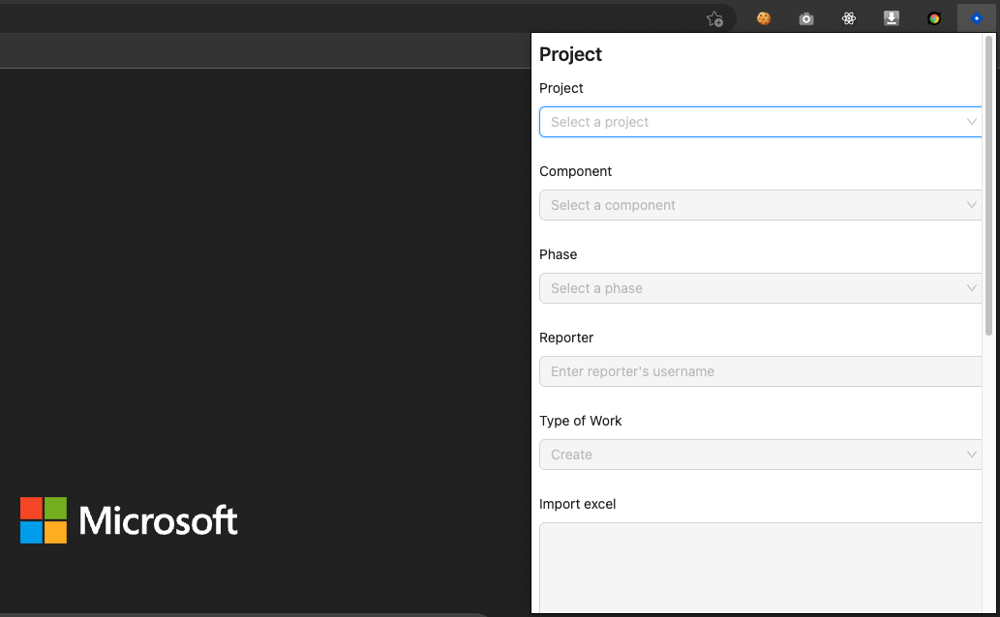
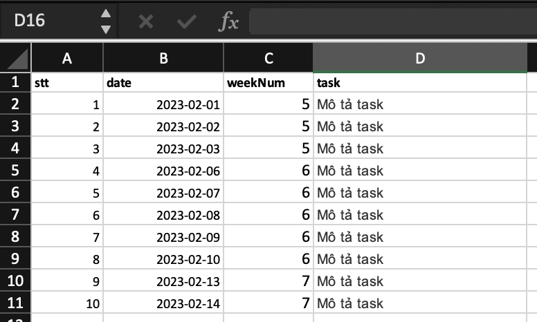

# Hướng dẫn sử dụng công cụ khai Jira

1. Tải extension từ cửa hàng Chrome:

[https://chrome.google.com/webstore/detail/ts-jira/obnpipipboogkpllehbibkikmbkcgpal?hl=en&authuser=0](https://chrome.google.com/webstore/detail/ts-jira/obnpipipboogkpllehbibkikmbkcgpal?hl=en&authuser=0)

2. Đăng nhập vào website Jira

3. Pin ứng dụng lên thanh taskbar của trình duyệt

4. Thực hiện nhập các thông tin cơ bản

- Chọn dự án

- Chọn component

- Chọn phase

- Nhập Reporter

- Chọn type of work

5. Thực hiện nhập dữ liệu từ template excel

Link tải template nằm trong popup của extension

6. Sao chép vào phần Import Excel

Lưu ý, bạn chỉ sao chép phần dữ liệu chính, không sao chép phần header (stt, date, weekNum, task)
Nhớ xóa các dòng trống ở cuối text (nếu có)

7. Submit
